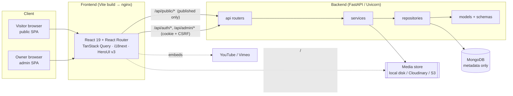

# Architecture — Svaneti with Georgie

_Last updated: 2026-07-14_

This document describes how the system is put together: the runtime topology,
the request flow, the layered backend, the publishing / dynamic-content
mechanism, internationalization, SEO, the frontend structure and deployment.
For data shapes see [`DATA_MODEL.md`](DATA_MODEL.md); for the HTTP contract see
[`API_SPECIFICATION.md`](API_SPECIFICATION.md).

## 1. System overview



Two SPAs are served from the same build: the **public site** (language-prefixed
routes) and the **owner dashboard** (`/admin`). Both talk to one FastAPI
backend. MongoDB stores **only documents/metadata** — binary media lives in the
media provider (local disk in dev; Cloudinary or S3 in prod) or is an external
YouTube/Vimeo URL.

## 2. Request flow

### Public read (e.g. a tour page)

1. Browser requests `/en/tours/ushguli-...`; the SPA renders and TanStack Query
   calls `GET /api/public/tours/:slug?lang=en`.
2. FastAPI router → `content` service → repository → Mongo. The service applies
   **effective visibility** (published + within publish window) so drafts 404.
3. Response carries `ETag: "v<content_version>"`. A repeat request with
   `If-None-Match` gets `304`.
4. The SPA separately polls `GET /api/public/content-version`; when the version
   changes it invalidates queries and refetches — new content appears with no
   rebuild.

### Admin mutation (e.g. publish a tour)

1. Owner is authenticated via HttpOnly `access_token` cookie (short-lived) with
   a rotating `refresh_token`.
2. State-changing request sends `X-CSRF-Token` matching the `csrf_token` cookie
   (double-submit). Missing/invalid → rejected.
3. Router → service performs the change, writes an **audit log**, and calls the
   content-version service to **bump `content_meta.version`**.
4. Public clients notice the new version on their next poll and refetch.

## 3. Backend layers

Strict one-directional layering (`api → services → repositories → models`):

```
backend/app/
  api/           # FastAPI routers — HTTP only: parse, authorize, serialize
    auth.py inquiries.py media.py overview.py pages.py public.py
    settings.py users.py audit.py admin_crud.py  helpers.py
  services/      # business logic — publishing, versioning, sanitize, seo, media…
    auth.py content.py content_version.py publishing.py sanitize.py
    seo.py media.py inquiry.py audit.py email.py serializers.py
  repositories/  # Mongo access (Motor) — base CRUD + collection registry
    base.py collections.py
  models/        # Pydantic domain models + common (publishing envelope)
    domain.py common.py
  schemas/       # request/response DTOs
    dto.py
  core/          # config, db client, deps, security, rate limiting
    config.py db.py deps.py security.py rate_limit.py
  seed/          # deterministic seed content + runner
    content.py run.py
  main.py        # app assembly, middleware, routers, SEO infra, media mount
```

- **api** does no business logic beyond auth/validation/serialization.
- **services** own publishing, version bumps, sanitization, SEO assembly, media
  variant generation, inquiries, audit.
- **repositories** wrap Motor collections; `admin_crud.py` provides a generic
  CRUD router for the many content resources, mounted **last** so specific
  routers win over its catch-all `/{resource}` routes.
- **MongoDB via Motor** (async). Indexes are created at startup from
  `core/db.py::ensure_indexes` (unique slugs/email, compound query indexes).

## 4. Authentication & session model

- **Password hashing:** Argon2 (`argon2-cffi`), tunable cost via env.
- **Access token:** signed JWT (HS256) in an **HttpOnly** cookie, short TTL
  (default 15 min).
- **Refresh token:** opaque random token, **hashed** in the `sessions`
  collection, **rotated** on every refresh; TTL default 14 days.
- **CSRF:** double-submit — a `csrf_token` cookie must equal the `X-CSRF-Token`
  header on state-changing requests (`hmac.compare_digest`).
- **Cookies:** `SameSite` (default `lax`), `Secure` in production, optional
  domain. Generic auth errors ("Invalid credentials") avoid user enumeration.
- Login is rate-limited (10/min/IP) with per-account lockout (5 failures →
  15-minute lock). See [`SECURITY.md`](SECURITY.md).

## 5. Media provider abstraction

A provider interface decouples storage from the app:

- **local** (dev): files on disk under `MEDIA_LOCAL_DIR`, served by FastAPI at
  `MEDIA_PUBLIC_BASE` (`/media`). Pillow generates `thumb`/`card`/`hero`
  variants.
- **cloudinary** / **s3** (prod): configured via env; upload returns hosted
  URLs. (These are provider stubs behind `MEDIA_PROVIDER`; local is fully
  implemented.)
- **external_video**: YouTube/Vimeo registered by URL; embedded client-side
  (CSP `frame-src` allows those hosts).

Uploads are validated (MIME allow-list, size cap `MEDIA_MAX_MB`, filename
sanitized). **Only metadata documents** are stored in MongoDB — never bytes.

## 6. Dynamic content & content-version

The heart of "publish in the dashboard → appears live with no rebuild":

- A singleton `content_meta` document holds an integer `version`.
- Any publish/unpublish/settings/navigation change calls the
  **content-version service**, which increments `version`.
- Every public response includes `ETag: "v<version>"`; `If-None-Match` yields
  `304 Not Modified` for cheap revalidation.
- The public SPA polls `GET /api/public/content-version` and, when `version`
  increases, invalidates TanStack Query caches so pages refetch.

## 7. Publishing model & effective visibility

Publishable documents share a **publishing envelope**:
`status (draft|scheduled|published|archived)`, `publishAt`, `unpublishAt`,
`publishedAt`, `createdBy`, `lastEditedBy`, `verificationStatus`, `isVerified`.

**Effective public visibility** (computed server-side):

```
visible  ⇔  status == "published"
        AND (publishAt   is null  OR  publishAt   <= now)
        AND (unpublishAt is null  OR  unpublishAt >  now)
```

Public endpoints only ever return effective-visible documents. Draft/scheduled
content is reachable exclusively through a **signed preview token**
(`/api/public/preview/:resource/:id?token=...`).

## 8. Internationalization (en / ka / ar)

- Localized fields use `{ en, ka?, ar? }` with **English required** and
  graceful English fallback (`tt()` helper).
- The frontend is language-prefixed (`/:lang/...`); i18next detects language
  from the path, then localStorage, then navigator.
- **Arabic is full RTL**: `applyDirection()` sets `<html dir="rtl" lang="ar">`;
  layout uses logical CSS properties; HeroUI's `I18nProvider` + `dir` mirror
  interactive components. Arabic is not LTR-with-Arabic-text — the whole UI flips.
- Georgian and Arabic use script-appropriate fonts (Noto Sans Georgian, IBM Plex
  Sans Arabic) — see [`UI_UX_SPECIFICATION.md`](UI_UX_SPECIFICATION.md).

## 9. SEO shell

- `GET /api/public/seo/route?path=` returns title, description, canonical, OG and
  **JSON-LD** (`LocalBusiness`, `BreadcrumbList`, `TouristTrip`) for a route, so
  the shell can emit correct metadata.
- `GET /sitemap.xml` (with hreflang alternates for en/ka/ar) and `/robots.txt`
  are served at the root.
- Per-document `SeoBlock` overrides site-level `seoDefaults`.

## 10. Frontend architecture

```
frontend/src/
  app/           # router.tsx, PublicLayout, LangLayout, AdminLayout
  components/
    site/        # Header, Footer, LanguageSwitcher, ThemeToggle, PopupHost,
                 # AnnouncementBar, WhatsAppFab, Seo
    content/     # TourCard, SvanetiMap (Leaflet), HelpMeChoose, sections.tsx
    admin/       # AdminTable, EditorModal, MediaPicker, LocalizedInput, …
    primitives.tsx
  features/      # feature modules
  pages/
    public/      # HomePage, ToursPage, TourDetailPage, …, DesignSystemPage
    admin/       # OverviewPage, ToursAdminPage, TourEditPage, LoginPage, …
  lib/           # api.ts, queries.ts, admin.ts, types.ts, nav.tsx,
                 # popupFrequency.ts, useUi.ts
  i18n/          # index.ts + locales/{en,ka,ar}.json
  styles/        # globals.css, theme.css (Alpine oklch tokens)
  main.tsx
```

- **Routing:** `createBrowserRouter`; `/` redirects to a detected language;
  public routes nest under `/:lang` (`LangLayout` → `PublicLayout`); admin
  routes under `/admin` with a login route outside the layout. Pages are
  **lazy-loaded**.
- **Data:** TanStack Query for fetching/caching; content-version polling drives
  invalidation. `lib/api.ts` centralizes fetch + credentials + CSRF header.
- **Forms:** React Hook Form + Zod resolvers.
- **Page builder:** a **section-renderer** (`components/content/sections.tsx`)
  maps a page's ordered `sections[]` (hero, tourGrid, gallery, testimonials,
  faq, map, cta, …) to components, so the homepage and others are data-driven
  and editable from `/admin/pages`.
- **UI:** HeroUI v3 (compound components, `onPress`, semantic variants) themed
  with the Alpine oklch token set; **no** HeroUIProvider/v2 patterns; Framer
  Motion only for restrained page reveals.
- The `/:lang/design-system` route is a **dev-only** showcase of the design
  system (not linked in navigation).

## 11. Deployment topology

`docker-compose.yml` defines three services:

| Service | Image / build | Port | Notes |
|---|---|---|---|
| `mongo` | `mongo:7` | 27017 | Named volume `mongo_data`; healthcheck via `mongosh` ping |
| `backend` | `./backend/Dockerfile` (Uvicorn) | 8000 | `env_file: .env`; `MONGODB_URI=mongodb://mongo:27017`; mounts `./backend/media_store`; waits for mongo health |
| `frontend` | `./frontend/Dockerfile` (nginx serving the Vite build) | 5173→80 | Depends on backend |

Seed and admin bootstrap are run as one-off commands against the backend
container (`docker compose exec backend python -m app.seed.run` /
`... scripts.create_admin`). Production hardening (secrets, `COOKIE_SECURE`,
managed Mongo, media provider) is covered in [`SECURITY.md`](SECURITY.md) and
[`EMERGENT_HANDOFF.md`](EMERGENT_HANDOFF.md).

## 12. Repository tree

```
Pet-Crawler/
├── README.md
├── CLAUDE.md
├── Makefile
├── docker-compose.yml
├── .env.example
├── EMERGENT_PROMPT.md
├── .github/workflows/ci.yml
├── backend/
│   ├── Dockerfile
│   ├── requirements.txt
│   ├── BACKEND_STATUS.md
│   ├── app/
│   │   ├── main.py
│   │   ├── api/            # routers
│   │   ├── services/       # business logic
│   │   ├── repositories/   # Mongo access
│   │   ├── models/  schemas/
│   │   ├── core/           # config, db, deps, security, rate_limit
│   │   └── seed/           # content + runner
│   └── tests/              # pytest (auth, authz, tours, public, inquiries, media)
├── frontend/
│   ├── Dockerfile  nginx.conf  index.html
│   ├── package.json  vite.config.ts  playwright.config.ts
│   ├── src/                # app, components, features, pages, lib, i18n, styles
│   └── e2e/                # Playwright specs
├── scripts/
│   └── create_admin.py     # owner bootstrap
├── tests/                  # cross-cutting test space
└── docs/                   # this file + the rest of the doc set
```
